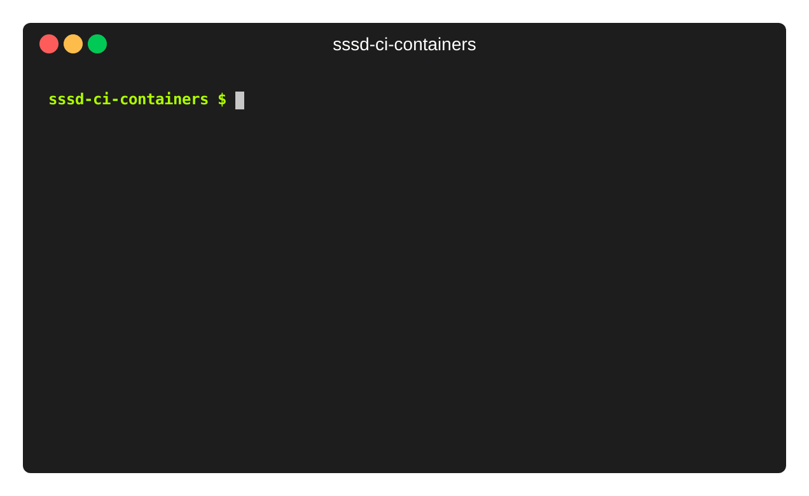
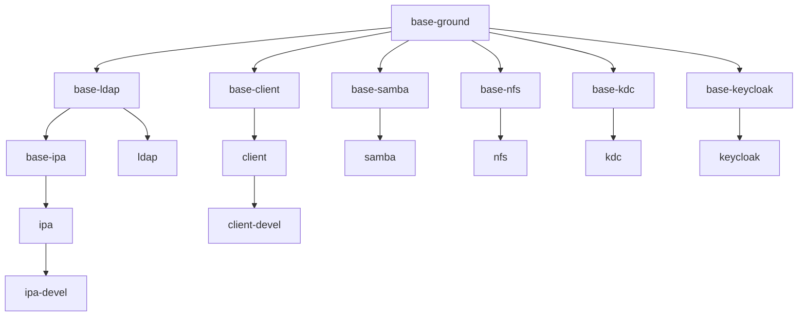

# SSSD Containers for CI

**These containers and images are intended to be used in SSSD CI and they should
not be used in production.** However, you can use them during SSSD local testing
and development.

## Quick start

```console
$ sudo dnf install -y podman podman-docker docker-compose
$ sudo systemctl enable --now podman.socket
$ sudo setsebool -P container_manage_cgroup true
$ cp env.example .env
$ sudo make up
$ sudo podman exec -it client /bin/bash
```

**Note:** once you get a console on the client container, you may want to bring
SSSD online because it has been most probably started before the other services
and therefore it went offline: `pkill --signal SIGUSR2 sssd`.



## Usage

First, create an environment file that is consumed by docker-compose:

```console
$ cp env.example .env
```

Then you can run the following `make` targets in order to start, stop and
destroy the containers.

* `sudo make up` reads `docker-compose.yml` and starts all services in containers
* `sudo make up-passkey` reads `docker-compose.yml` and `docker-compose.passkey.yml` to add passkey support and start all services in containers
* `sudo make stop` stops the containers, keeps theirs content
* `sudo make down` destroys and removes the containers
* `sudo make update` update images

You can gain console access once the containers are started, either through
podman or ssh. For example:

```console
$ sudo podman exec -it client /bin/bash
$ sudo podman exec -it -u ci client /bin/bash
$ sudo podman exec -it client /bin/tmux
$ ssh -l ci -i ./data/ssh-keys/ci.id_rsa 172.16.100.40
$ ssh -l root -i ./data/ssh-keys/root.id_rsa 172.16.100.40
```

See [Available containers](#available-containers) for container names, IP
adresses and DNS names. See [Host configuration](#host-configuration) to
configure your system DNS resolver so you can use DNS names directly instead of
using IP addresses in the ssh command.

## Host configuration

You can trust sssd-ci self signed CA certificate and setup DNS forwarding on
your local host in order to access provided services directly outside the
containers (for example accessing IPA Web UI at `https://master.ipa.test` or
perfoming an `ldapsearch`).

* `sudo make trust-ca` configure your system to trust sssd-ci CA
* `sudo make setup-dns` forward all `*.test` queries to sssd-ci DNS server.
  *Note that this will disable systemd-resolved and enable dnsmasq in
  NetworkManager.*
* `sudo make setup-dns-files` append containers fully qualified hostnames to
  */etc/hosts* so they can be resolved directly without DNS. *You can use it
  instead of `setup-dns` on systems where it is not desired or possible to
  tinker with systemd-resolved or NetworkManager configuration.*

## Available containers

| Name         |        IP       |            FQDN            | Description                         |
|--------------|-----------------|----------------------------|-------------------------------------|
| ipa          | `172.16.100.10` | `master.ipa.test`          | IPA server                          |
| ldap         | `172.16.100.20` | `master.ldap.test`         | TLS ready 389 Directory Server      |
| samba        | `172.16.100.30` | `dc.samba.test`            | Samba DC root domain                |
| client       | `172.16.100.40` | `client.test`              | Client machine with configured SSSD |
| nfs          | `172.16.100.50` | `nfs.test`                 | NFS server                          |
| kdc          | `172.16.100.60` | `kdc.test`                 | Kerberos KDC                        |
| keycloak     | `172.16.100.70` | `master.keycloak.test`     | Keycloak IdP                        |

## Available user accounts

All passwords are set to `Secret123`.

| Machine           |        Username                |   Password   |   Description     |
|-------------------|--------------------------------|--------------|-------------------|
| Any Linux machine | root                           | Secret123    | Local user        |
| Any Linux machine | ci                             | Secret123    | Local user        |
| samba             | Administrator@samba.test       | Secret123    | Domain user       |
| ipa               | admin@ipa.test                 | Secret123    | Domain user       |

## Available tools

Please, view the [packages](src/ansible/roles/packages) ansible role to see the
installed packages:

* [Fedora, CentOS](src/ansible/roles/packages/tasks/Fedora.yml)
* [Debian](src/ansible/roles/packages/tasks/Debian.yml)
* [Ubuntu](src/ansible/roles/packages/tasks/Ubuntu.yml)

## Out of the box use cases

The following use cases are supported out of the box:

* `sssd` with single domain connected to LDAP
* `sssd` with single domain connected to IPA
* `sssd` with single domain connected to Samba DC via `ad` provider
* `sssd` connected to IPA with one trusted Samba DC domain
* `sssd` connected to multiple domains

## Selecting container images tag

There are images available for multiple distributions. See the
[catalog](https://quay.io/repository/sssd/ci-client?tab=tags) for all available
tags.

You can set the `TAG` environment variable to choose the tag the should be used
when starting the containers. You can also set it in the `.env` file if you
intend to use it for a longer time.

Most notable tags are:
* `latest` - this is the latest Fedora stable compose
* `rawhide` - this is the latest Fedora rawhide compose

We currently have full support for Fedora and CentOS Stream and a limited
support for Debian and Ubuntu. The client is always created from the target
distribution, but if any service is unavailable on that distribution (like
samba-dc on CentOS Stream) it is created from `fedora:latest` instead.

## Overriding images

There is also a development version to
[ci-client](https://quay.io/repository/sssd/ci-client) and
[ci-ipa](https://quay.io/repository/sssd/ci-ipa) images, named
[ci-client-devel](https://quay.io/repository/sssd/ci-client-devel) and
[ci-ipa-devel](https://quay.io/repository/sssd/ci-ipa-devel). These images
contains preinstalled development dependencies, which makes it unfortunately
quite large. However, it is suitable for use when coding on SSSD. You can use it
by overriding docker-compose values in `docker-compose.override.yml` file:

```yml
services:
  client:
    image: ${REGISTRY}/ci-client-devel:${TAG}
  ipa:
    image: ${REGISTRY}/ci-ipa-devel:${TAG}
```

## Using real Active Directory instance

Active Directory does not run in containers so we have Samba DC container to
mitigate this. However, there may be situations when we need to test against
real Active Directory running on a Windows server. There is a virtual machine
defined in [Vagrantfile](./src/Vagrantfile) that can be instantiated via
[vagrant](https://www.vagrantup.com/).

| Name         |        IP       |      FQDN       | Netbios name | Description    |
|--------------|-----------------|-----------------|--------------|----------------|
| ad           | `172.16.200.10` | `dc.ad.test`    | `AD`         | AD forest root |

### Preqrequisites

The following vagrant plugins are required:

* `vagrant-libvirt`
* `winrm` and `winrm-elevated` (these are built-in to the official [Hashicorp package](https://www.vagrantup.com/downloads))

There are often compatibility issues and bugs when mixing packages provided by
Linux distributions and non-packaged plugins that require difficult workarounds.
We recommend to use vagrant from
[quay.io/sssd/vagrant:latest](https://quay.io/repository/sssd/vagrant?tab=tags&tag=latest)
container instead to prevent any issues. You can define the following function
in your `.bashrc`:

```bash
function vagrant {
  dir="${VAGRANT_HOME:-$HOME/.vagrant.d}"
  mkdir -p "$dir/"{boxes,data,tmp}

  podman run -it --rm \
    -e LIBVIRT_DEFAULT_URI \
    -v /var/run/libvirt/:/var/run/libvirt/ \
    -v "$dir/boxes:/vagrant/boxes" \
    -v "$dir/data:/vagrant/data" \
    -v "$dir/tmp:/vagrant/tmp" \
    -v $(realpath "${PWD}"):${PWD} \
    -w $(realpath "${PWD}") \
    --network host \
    --security-opt label=disable \
    quay.io/sssd/vagrant:latest \
      vagrant $@
}
```

### Starting and stopping the virtual machine

```console
$ cd ./src
$ vagrant up
$ vagrant halt
$ vagrant destroy
```

### Creating IPA trust

First, start the CI containers with `sudo make up`, after that you can setup trust
between `ipa.test` and `ad.test`.

```console
$ sudo podman exec ipa /usr/bin/bash -c 'echo Secret123 | kinit admin && echo vagrant | ipa trust-add ad.test --admin Administrator --password'
```

### Joining client into the ad.test domain

First, start the CI containers with `sudo make up`, after that you can enroll the client to `ad.test` domain.

```console
sudo podman exec client /usr/bin/bash -c 'echo -e Administrator\nvagrant | realm join ad.test'
```

# Advanced topics

## Recreating certificates and ssh keys

The certificates are stored in [data/certs](./data/certs) and will expire in
2041, so the should be no need to regenerate them any time soon. There should be
no need to regenerate ssh keys in [data/sssh-keys](./data/ssh-keys) either. However, you can do it by calling the following two scripts:

```console
$ ./src/tools/gen-certs.sh
$ ./src/tools/gen-ssh-keys.sh
```

## Building images

The images are build and published automatically in GitHub actions in the [build
workflow](./.github/workflows/build.yml) on each push and automatically every
Sunday.

If you need to build them manually, you can do it by calling the `build` make
target. It takes multiple environment variables:

* `BASE_IMAGE`: base image that should be used, default is
  `registry.fedoraproject.org/fedora:latest`
* `TAG`: tag of the result images, default is `latest`
* `UNAVAILABLE`: space separated list of unavailable services, default is empty
  (all services are available). If multiple values are provided, you need to
  enclose them in quotation marks, e.g. `"ipa ldap samba"`

The following example builds the CentOS Stream 8 images:

```console
$ sudo make build BASE_IMAGE=quay.io/centos/centos:stream8 TAG=centos-8 UNAVAILABLE=samba
```

The images are stored in local `localhost/sssd` image registry.

## Publishing images

The images are automatically published on successful build of GitHub actions
[build workflow](./.github/workflows/build.yml) so there should be no need to do
this manually. However, you can do it by calling the `push` make target. It
takes multiple environment variables:

* `REGISTRY`: target registry where the images will be pushed, required
* `TAG`: tag of the local images in `localhost/sssd` that will be pushed, it is
  also used as the destination tag, required
* `EXTRA_TAGS`: space separated list of additional tags for the image, default
  is empty (no additional tag), e.g. `fedora-latest latest`

## Image layers

The images are build from multiple layers in order to safe space. The layers
are:


